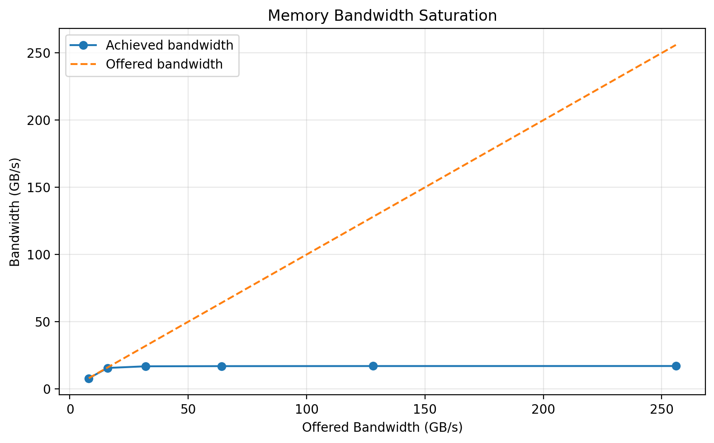
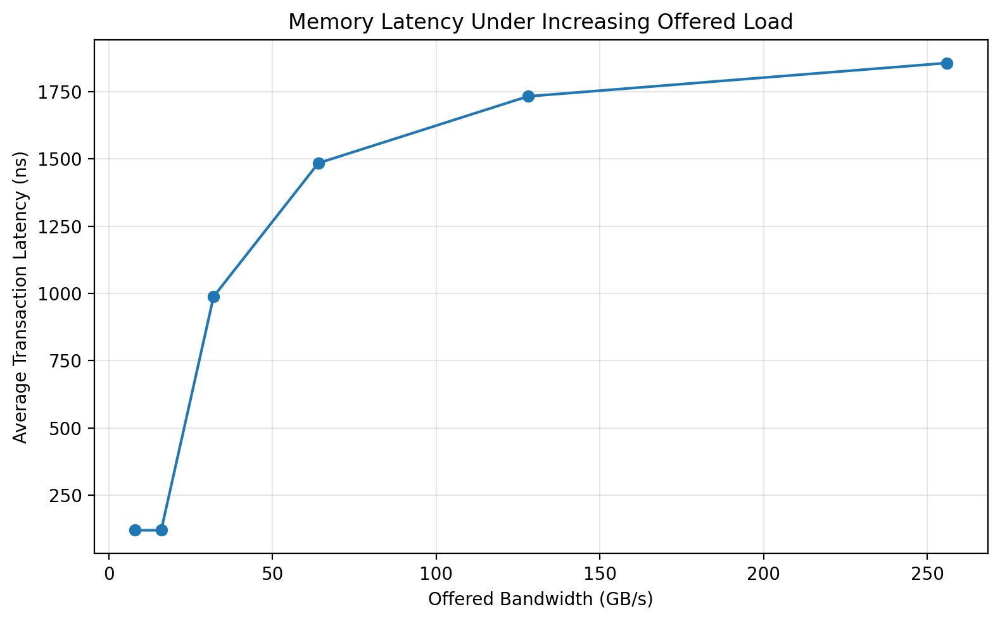
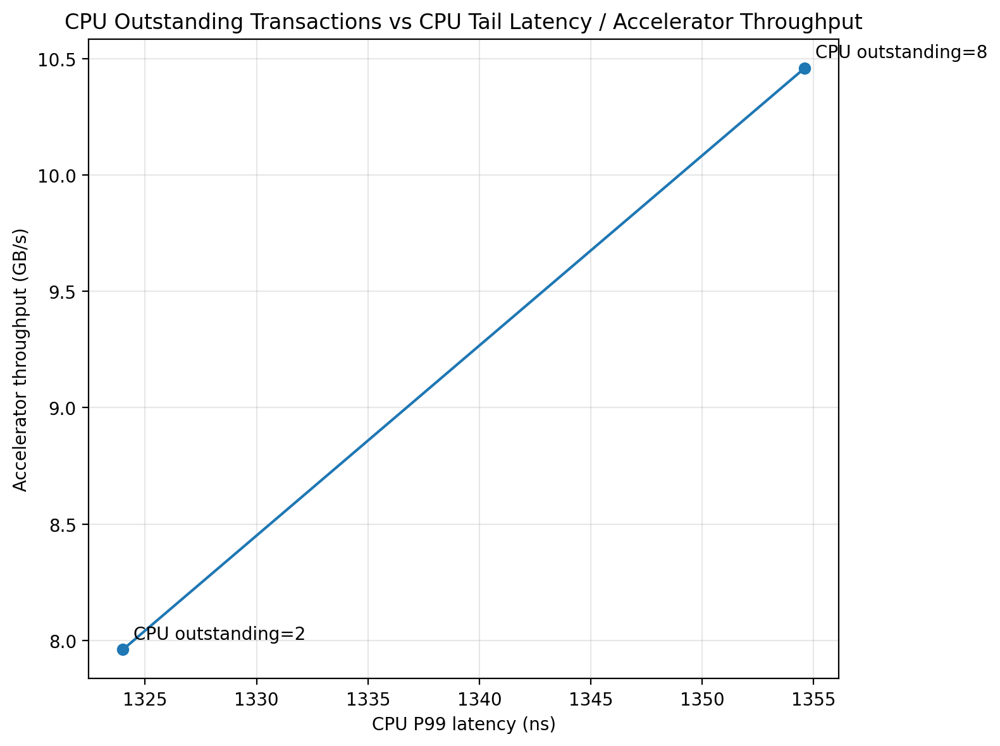

# Cycle-Approximate SoC Performance Model

A cycle-approximate SystemC/TLM-2.0 model for exploring SoC memory-system performance, AXI-style interconnect behavior, QoS arbitration, outstanding transactions, and memory bandwidth saturation.

The model represents CPU, DMA, and DNN accelerator traffic sharing an AXI-style interconnect and a banked memory subsystem. Python-based design-space exploration (DSE) is used to evaluate architectural trade-offs and generate Pareto frontiers.

## Key Features

- SystemC/TLM-2.0 transaction-level modeling
- CPU, DMA, and DNN accelerator traffic generators
- AXI4-style transaction modeling
- Configurable outstanding transaction limits
- AXI interconnect buffering and backpressure
- QoS-based arbitration
- Round-robin and fixed-priority arbitration infrastructure
- Banked DRAM-style memory model
- Row-hit / row-miss latency modeling
- Read-priority and hysteretic write-drain scheduling
- Memory bandwidth saturation analysis
- CPU average / P50 / P95 / P99 latency measurement
- Accelerator traffic throughput measurement
- Python-automated design-space exploration
- Pareto frontier generation

---

## Architecture

```text
                  +----------------+
                  |      CPU       |
                  | MSHR-like      |
                  | outstanding   |
                  +-------+--------+
                          |
                          v
                  +----------------+
                  | AXI-style      |
                  | Interconnect   |
                  |                |
                  | QoS Arbitration|
                  | Buffers        |
                  | Backpressure   |
                  +-------+--------+
                          |
             +------------+------------+
             |            |            |
       +-----v----+ +-----v-----+ +----v------+
       |   DMA    | |    DNN    | |  Memory   |
       | Traffic  | | Accelerator| | Controller|
       +----------+ +-----------+ +-----+-----+
                                         |
                               +---------v---------+
                               |    Banked DRAM    |
                               |                   |
                               |  8 Banks          |
                               |  Row Hit:  50 ns  |
                               |  Row Miss: 120 ns |
                               +-------------------+
```

The model separates traffic generation, interconnect behavior, arbitration, memory-controller scheduling, and DRAM timing so that architectural parameters can be explored independently.

See:

docs/architecture.md
docs/assumptions.md
docs/experiments.md
docs/methodology.md
Modeled Components
CPU

The CPU model generates memory requests using a closed-loop outstanding-request mechanism.

The configurable outstanding capacity acts as an MSHR-like limit. When the limit is reached, additional memory requests are stalled until earlier transactions complete.

CPU performance is evaluated using:

Average latency
P50 latency
P95 latency
P99 latency
Maximum latency
DMA

The DMA model generates bulk memory traffic and tracks completed bytes.

DNN Accelerator

The DNN accelerator generates memory traffic representing accelerator data movement and tracks completed bytes.

The reported accelerator throughput represents aggregate modeled DMA + DNN memory traffic throughput, rather than application-level neural-network performance.

AXI-style Interconnect

The interconnect models:

Transaction routing
Buffering
Backpressure
Outstanding transactions
QoS-based arbitration

The implementation is an architectural performance model and is not intended to be an RTL-equivalent AXI protocol implementation.

Memory Controller

The memory controller models:

Separate read/write request queues
Read-priority scheduling
Hysteretic write-drain behavior
Bank-level serialization
Queue and service statistics

Write-drain mode is entered when write occupancy reaches the configured high watermark and exits after the queue falls below the low watermark.

DRAM Model

The DRAM model contains:

8 banks
Open-row tracking
Row-hit latency: 50 ns
Row-miss latency: 120 ns
Bank serialization

The timing model is intentionally simplified for architectural exploration and is not a JEDEC-accurate DRAM model.

Experimental Results
1. Memory Bandwidth Sweep

A direct memory-subsystem bandwidth sweep was performed using:

256-byte transactions
256 transactions per measurement point
Injection intervals from 32 ns down to 1 ns
8-bank memory configuration
Injection Interval	Offered BW	Achieved BW	Avg. Latency
32 ns	8 GB/s	7.915 GB/s	120 ns
16 ns	16 GB/s	15.604 GB/s	120 ns
8 ns	32 GB/s	16.821 GB/s	988 ns
4 ns	64 GB/s	16.943 GB/s	1484 ns
2 ns	128 GB/s	17.005 GB/s	1732 ns
1 ns	256 GB/s	17.036 GB/s	1856 ns

Under the modeled 8-bank memory configuration and timing assumptions, the memory subsystem saturated at approximately 17 GB/s.

At low offered load, achieved bandwidth tracks the offered rate. Once the memory subsystem becomes saturated, additional offered traffic primarily increases transaction latency rather than sustained bandwidth.

2. End-to-End SoC Performance

The modeled end-to-end workload measures CPU latency and aggregate accelerator memory traffic.

Representative measured configuration:

Parameter	Value
CPU QoS	8
DMA QoS	4
DNN QoS	12
CPU outstanding	8
DMA outstanding	16
DNN outstanding	32
AXI queue depth	16

Measured results:

Metric	Result
CPU completed requests	10
CPU average latency	788.8 ns
CPU P50 latency	822.0 ns
CPU P95 latency	1333.0 ns
CPU P99 latency	1354.6 ns
CPU maximum latency	1360 ns
DMA completed bytes	5120 B
DNN completed bytes	9216 B
Accelerator traffic	14336 B
Workload duration	1370 ns
Accelerator throughput	10.4642 GB/s

These measurements represent the behavior of the implemented synthetic workload under the stated architectural assumptions.

3. QoS Design-Space Exploration

Python automation evaluates combinations of:

CPU QoS
DMA QoS
DNN QoS

while collecting:

CPU P99 latency
Accelerator traffic throughput
Completed traffic
Workload duration

The DSE objectives are:

Minimize CPU P99 latency
Maximize accelerator traffic throughput

Results are written to:

results/dse_results.csv
results/pareto_frontier.csv
results/pareto_frontier.png
4. CPU Outstanding-Transaction DSE

A focused DSE sweep varied CPU outstanding capacity while keeping the other architecture parameters fixed.

CPU Outstanding	CPU P99	Accelerator Throughput
2	1324.00 ns	7.96 GB/s
4	1354.60 ns	9.96 GB/s
8	1354.60 ns	10.46 GB/s
16	1354.60 ns	10.46 GB/s

The resulting non-dominated objective points were:

CPU Outstanding	CPU P99	Accelerator Throughput
2	1324.00 ns	7.96 GB/s
8	1354.60 ns	10.46 GB/s

Increasing CPU outstanding capacity from 2 to 8 increased modeled accelerator traffic throughput from 7.96 GB/s to 10.46 GB/s, while CPU P99 latency increased from 1324.0 ns to 1354.6 ns.

This demonstrates the type of CPU-latency versus accelerator-throughput trade-off that the model is intended to expose.

Results:

results/outstanding_dse.csv
results/outstanding_pareto.csv
results/outstanding_pareto.png
Design-Space Exploration

The DSE flow is automated using Python.

QoS sweep
python3 scripts/run_dse.py

Generates:

results/dse_results.csv
results/pareto_frontier.csv
results/pareto_frontier.png
CPU outstanding sweep
python3 scripts/run_outstanding_dse.py

Generates:

results/outstanding_dse.csv
results/outstanding_pareto.csv
results/outstanding_pareto.png
Individual configuration

The simulator exposes architectural parameters through:

./build/soc_sim --dse \
    <cpu_qos> \
    <dma_qos> \
    <dnn_qos> \
    <cpu_outstanding> \
    <dma_outstanding> \
    <dnn_outstanding> \
    <axi_queue_depth>

Example:

./build/soc_sim --dse 8 4 12 8 16 32 16
Building
Requirements
Linux / WSL
C++17 compiler
CMake
SystemC
Python 3

The current CMake configuration expects SystemC at:

/usr/local/systemc

This can be changed using the SYSTEMC_PREFIX CMake option.

Build
cd ~/axi-soc-performance-model
mkdir -p build
cd build
cmake ..
make -j$(nproc)

The simulator will be generated as:

build/soc_sim
Running

From the project root:

Normal end-to-end simulation
./build/soc_sim
Memory scheduler stress test
./build/soc_sim --stress
Memory bandwidth sweep
./build/soc_sim --bandwidth
Individual DSE configuration
./build/soc_sim --dse 8 4 12 8 16 32 16
Automated QoS DSE
python3 scripts/run_dse.py
Automated CPU outstanding DSE
python3 scripts/run_outstanding_dse.py
Methodology

The performance-modeling flow is:

Architectural Model
        |
        v
Traffic Generation
        |
        v
AXI / Interconnect Modeling
        |
        v
Memory Controller
        |
        v
DRAM Timing Model
        |
        v
Performance Measurement
        |
        v
Python DSE
        |
        v
Pareto Analysis

The model is used to investigate questions such as:

How does memory pressure affect CPU tail latency?
When does the modeled memory subsystem saturate?
How much accelerator memory traffic can be sustained?
How does CPU outstanding capacity affect system behavior?
What configurations expose different CPU-latency / accelerator-throughput trade-offs?

See docs/methodology.md for detailed metric definitions.

Repository Structure
.
├── CMakeLists.txt
├── README.md
│
├── docs/
│   ├── architecture.md
│   ├── assumptions.md
│   ├── experiments.md
│   └── methodology.md
│
├── results/
│   ├── dse_results.csv
│   ├── pareto_frontier.csv
│   ├── pareto_frontier.png
│   ├── outstanding_dse.csv
│   ├── outstanding_pareto.csv
│   ├── outstanding_pareto.png
│   ├── memory_bandwidth.csv
│   ├── memory_bandwidth.png
│   └── memory_latency.png
│
├── scripts/
│   ├── run_dse.py
│   ├── run_outstanding_dse.py
│   └── plot_results.py
│
└── src/
    ├── arbitration/
    ├── axi/
    ├── memory/
    ├── simulation/
    └── traffic/

The build/ directory and compiled binaries are intentionally excluded from version control.

## Limitations

This project is an architectural performance model, not an RTL implementation or a JEDEC/cycle-accurate DDR/LPDDR controller.

Important simplifications include:

Simplified DRAM timing
No JEDEC command-level timing
No refresh modeling
No detailed DRAM scheduling such as FR-FCFS
Synthetic CPU/DMA/DNN traffic
AXI-style behavior rather than complete protocol compliance
Accelerator throughput represents modeled memory traffic, not application-level DNN compute performance

Therefore, numerical results should be interpreted as results of the modeled architecture and assumptions rather than measurements of a specific commercial DDR/LPDDR device or SoC.

## Experimental Results

### Memory Bandwidth Saturation



The modeled memory subsystem saturates at approximately **17 GB/s** under the Phase 15 workload and timing assumptions.

| Offered BW | Achieved BW | Avg. Latency |
|---:|---:|---:|
| 8 GB/s | 7.915 GB/s | 120 ns |
| 16 GB/s | 15.604 GB/s | 120 ns |
| 32 GB/s | 16.821 GB/s | 988 ns |
| 64 GB/s | 16.943 GB/s | 1484 ns |
| 128 GB/s | 17.005 GB/s | 1732 ns |
| 256 GB/s | 17.036 GB/s | 1856 ns |

### Memory Latency Under Load



Latency remains near the modeled row-miss service time at low load and rises sharply once the memory subsystem becomes saturated.

### CPU P99 vs Accelerator Throughput



A focused design-space exploration varied CPU outstanding capacity.

| CPU Outstanding | CPU P99 | Accelerator Throughput |
|---:|---:|---:|
| 2 | 1324.0 ns | 7.96 GB/s |
| 8 | 1354.6 ns | 10.46 GB/s |

Increasing CPU outstanding capacity from 2 to 8 increased modeled accelerator throughput by approximately **31.4%**, while CPU P99 latency increased by approximately **2.3%**.

---

## Technologies

- C++17
- SystemC
- TLM-2.0
- Python
- CMake
- AXI-style interconnect modeling
- Computer Architecture
- Memory-System Modeling
- Design-Space Exploration

## Author

Sachin Yaduvandu

M.Tech VLSI & Embedded Systems

**Focus areas:**

- SoC Performance Modeling
- SystemC / TLM-2.0
- Computer Architecture
- Interconnect & Memory-System Modeling
- Architecture Exploration
- Pre-Silicon Performance Analysis
